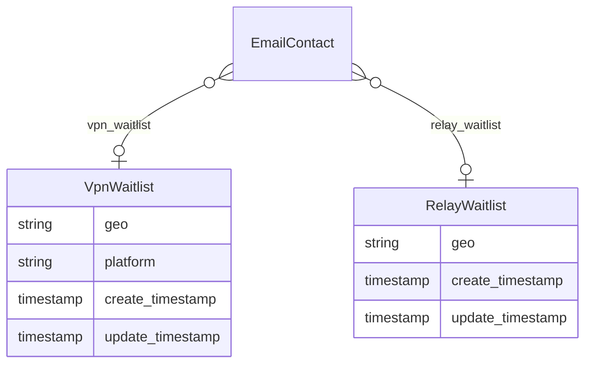
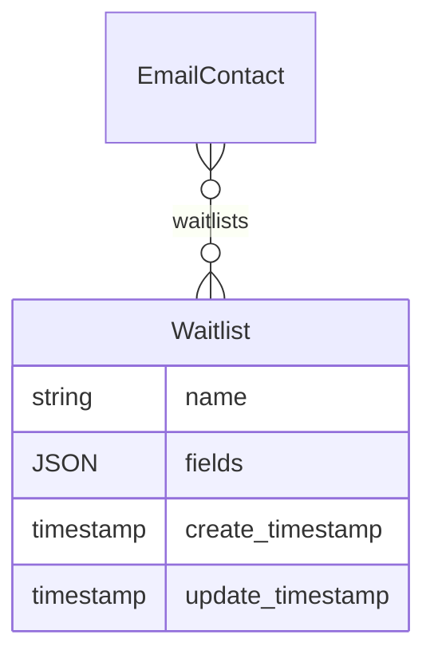
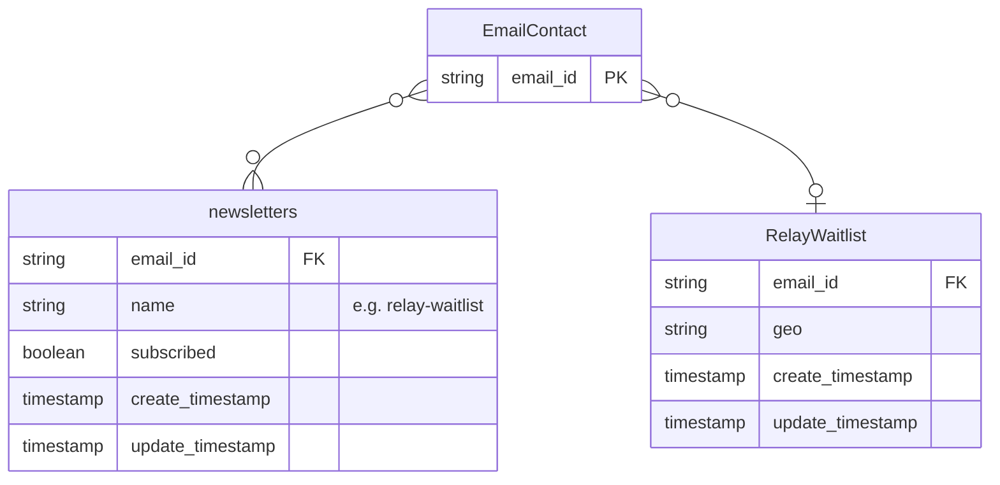

# Waitlists as Relationships

* Status: approved
* Deciders: <CTMS stakeholders> + <Basket stakeholders>
* Date: November 25, 2022

## Context and Problem Statement

Onboarding new waiting lists requires changing, releasing, and redeploying both CTMS and Basket.

Each waitlist may have its own schema with specific collected fields (eg. `country`, `platform`, ...).

Basket uses [some specific code](https://github.com/mozmeao/basket/blob/341facbb2b199bfe2f26488942d0fa251010c1c8/basket/news/backends/ctms.py#L84-L87) to transform flat form data into CTMS nested objects, that has to be modified when a new waitlist has to be sent to CTMS.

CTMS [stores the different waitlists as individual tables](https://github.com/mozilla-it/ctms-api/blob/3d0c0071c8f2565f1a24f039adc4f5526d58e0d2/ctms/models.py#L63-L66), with a relationship in the Email contact model. And in order to validate the submitted fields, each waitlist [has its own schema](https://github.com/mozilla-it/ctms-api/blob/3d0c0071c8f2565f1a24f039adc4f5526d58e0d2/ctms/schemas/vpn.py#L10-L32). If tomorrow we have to onboard 50 new waitlists, we would have to create 50 new tables in the database.

Our current approach to onboard a new waiting lists obliges us:

1. Open a pull-request to add the tables and schemas in CTMS
1. Request and wait for review
1. Request and wait for release
1. Request to run database migrations
1. Request and wait for deployment
1. Open a pull-request to modify the CTMS mapping code in Basket
1. Request and wait for review
1. Request and wait for release
1. Request and wait for deployment

The amount of code to be modified in each step is reasonably low, but the amount of coordination and efforts to enable a new waiting list is too high.

We are looking for a solution to streamline waitlists onboarding.

## Decision Drivers

In order to choose our solution we considered the following criteria:

- **Complexity**: Low → High: how complex is the solution
- **Cost**: Low → High: how much engineering efforts is required
- **Onboarding Efforts**: Low → High: how much efforts are necessary

## Considered Options

0. [Option 0 - Do nothing](#option-0---do-nothing)
1. [Option 1 - Store waitlists as relationships](#option-1---store-waitlists-as-relationships)
2. [Option 2 - Option 1 + Generic waitlists forms in Basket](#option-2---option-1--generic-waitlists-forms-in-basket)
3. [Option 3 - Option 2 + Waitlist schemas in database](#option-3---option-2--waitlist-schemas-in-database)

## Decision Outcome

Chosen option: Option X because XX

## Pros and Cons of the Options


### Option 0 - Do nothing

**Complexity**: N/A

**Cost**: N/A

**Onboarding Efforts**:

High: See problem statement.


### Option 1 - Store waitlists as relationships

This option consists in replacing the individual waitlist tables by a generic table.

Current:



Proposed:



For example:

```json
{
  "first_name": "John",
  "last_name": "Doe",

  "waitlists": [
    {"name": "vpn", "fields": {"geo": "fr", "platform": "win64"}, "create_timestamp": 123456, "update_timestamp": 876543},
    {"name": "relay", "fields": {"geo": "fr"}, "create_timestamp": 123456, "update_timestamp": 876543},
  ]
}
```


This would mimic what currently already [exists for newsletters](https://github.com/mozilla-it/ctms-api/blob/3d0c0071c8f2565f1a24f039adc4f5526d58e0d2/ctms/models.py#L58-L60).

The database migration is relatively obvious: create the new table, copy from the individual tables to the new one, delete individual tables (see details below).

Unlike newsletters, waitlists have custom fields. In order to validate the fields when data is posted (by Basket), we could keep the approach of having hard-coded pydantic schemas in the CTMS code base.

Each waitlist would have a dedicated schema:

```py
class BasicWaitlistFields(BaseModel):
    geo: Optional[str] = Field(...)

class VpnWaitlistFields(BasicWaitlistFields):
    platform: Optional[str] = Field(...)

class HubWaitlistFields(BasicWaitlistFields):
    referrer: str = Field(...)
    secret: str = Field(...)
```

The contact would have a list of waitlists, whose fields are validated according to the waitlist name:

```py
class ContactSchema(BaseModel):
    email: EmailSchema
    newsletters: List[NewsletterSchema] = []
    waitlists: List[WaitlistSchema] = []


WAITLISTS_FIELDS_SCHEMAS_BY_NAME = {
    "vpn": VpnWaitlistFields,
    "hub": HubWaitlistFields,
}

class WaitlistSchema(BaseModel):
    name: str = Field(...)
    fields: dict = Field(...)

    @root_validator
    def check_fields(cls, values):
        waitlist_name = values.get("name")
        fields_schema = WAITLISTS_FIELDS_SCHEMAS_BY_NAME.get(waitlist_name, BasicWaitlistFields)
        try:
            fields_schema(**values.get("fields"))
        except ValidationError as e:
            # ...
```

Once the data is validated, it can be stored in the `JSON` column of the `WaitList` table.

In order to maintain the current columns synchronized in Acoustic (eg. `vpn_waitlist_geo`, `vpn_waitlist_platform`, `relay_waitlist_geo`), some parts of the [CTMSToAcousticService](https://github.com/mozilla-it/ctms-api/blob/3d0c0071c8f2565f1a24f039adc4f5526d58e0d2/ctms/acoustic_service.py#L152-L166) will have to modified.
Transforming the contact's waitlists into flat columns to be synchronized in Acoustic seems achievable by leveraging the `AcousticField` entries, or adding a new notion like `AcousticWaitlistMappings` similar to what exists for newsletters.

> Note: We assume here that we would want to keep the same approach, ie. using flat columns in Acoustic instead of Accoustic relational tables.

**Complexity**: Low

The plan described above globally follows what already exists with newsletters.

On the long term, if many waitlist had to be integrated, this would lower the complexity compared to the current approach.

The validation of incoming data does not differ much from the current approach with hardcoded schemas, and does not introduce much complexity.

**Cost**: Medium

The amount of code to understand and modify is not negligible.

In terms of deployment, and continuity of service with Basket, we would perhaps have an intermediary phase where both the previous flat fields (`vpn_waitlist` and `relay_waitlist`) and the new schema (`waitlists` list) are supported. Once Basket will post the data in the proper format, we can stop accepting the former fields.

**Onboarding Efforts**: Medium

In order to onboard a new waitlist we would have to:

1. Open a pull-request to add schemas in CTMS
1. Request and wait for review
1. Request and wait for release
1. Request and wait for deployment
1. Open a pull-request to modify the CTMS mapping code in Basket
1. Request and wait for review
1. Request and wait for release
1. Request and wait for deployment

It is only one less step that the current situation, we don't have to run database migrations anymore.


### Option 2 - Option 1 + Generic waitlists forms in Basket

This option would consists in turning the waitlists forms in Basket into generic forms.

For example, instead of receiving form data in this form:

```json
{
    "fpn_country": "fr",
    "fpn_platform": "win64",
}
```

That then has [to be explicitly transformed in Basket](https://github.com/mozmeao/basket/blob/341facbb2b199bfe2f26488942d0fa251010c1c8/basket/news/backends/ctms.py#L84-L87) into:

```json
{
    "vpn_waitlist": {
        "geo": "fr",
        "platform": "win64",
    }
}
```

We imagine a situation where waitlist forms submit data to Basket in this form:

```json
{
    "name": "vpn",
    "fields": {
        "geo": "fr",
        "platform": "win64"
    },
}
```

And on which there is no need for explicit transformation. Any future waitlist would fit in this format.

**Complexity**: Low

This has the same complexity as *Option 1*, removing the transformation would actually simplify the system.

**Cost**: Medium-High

The existing waitlist forms on the different landing pages have to be modified to fit in this new model.

**Onboarding Efforts**: Low

In order to onboard a new waitlist we would have to:

1. Open a pull-request to add schemas in CTMS
1. Request and wait for review
1. Request and wait for release
1. Request and wait for deployment

There is no need to modify or redeploy Basket anymore.


### Option 3 - Option 2 + Waitlist schemas in database

This option would be the same as *Option 1* or *Option 2*, but instead of having hardcoded waitlist fields schemas in the CTMS code base, they would be stored in a dedicated table, as JSON schema for example.

This way, onboarding a new waitlist would only consists in adding a new row in the `WaitlistFieldsSchemas` table.

When waitlist data is submitted, we look up the fields schema, and validate the fields:

```py
class WaitlistSchema(BaseModel):
    name: str = Field(...)
    fields: dict = Field(...)

    @root_validator
    def check_fields(cls, values):
        waitlist_name = values.get("name")

        entry = WaitlistFieldsSchemas\
            .filter(name == waitlist_name)\
            .get_one_or_none()

        json_schema = json.parse(entry.schema)
        validator = JSONSchemaValidator(json_schema)
        try:
            validator.validate(**values.get("fields"))
        except ValidationError as e:
            # ...
```

A management command allows to list/add/remove schemas:

```
python ctms/bin/waitlist_fields_schemas.py add 'relay' '{"properties": {"geo": {"type": "string"}}}'
```

**Complexity**: Medium

This is obviously more complex than hardcoded schemas.

**Cost**: Medium

This would follow what has been done for the list of Acoustic fields and Newsletter mappings.

**Onboarding Efforts**: Very Low

In order to onboard a new waitlist we would have to:

1. Run a command to add the new fields schema

There is no need to modify or redeploy CTMS or Basket anymore.


## About Data Migration

Each row of the `vpn_waitlist` table will become a row in the `waitlist` with `name = "vpn"`.

Each row of the `relay_waitlist` table will be turned into one or multiple rows in the `waitlist`, depending on subscribed newsletters.



All subscriptions to newsletters starting with `relay-` will be turned into a row in the `waitlist` table. For example, if a contact has subscribed to the `relay-vpn-waitlist`, then a row in the `waitlist` table will be created with `name="relay-vpn"`.

TODO: Shall newsletters rows be deleted?

TODO: Shall all newsletters rows ending with `-waitlist` be turned into `waitlist` rows? eg. graceland?
