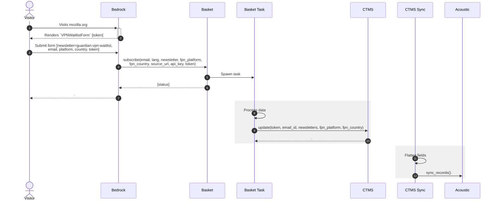

# Bedrock Basket CTMS Acoustic

* [Bedrock](https://github.com/mozilla/bedrock/) powers https://www.mozilla.org
* [Basket](https://github.com/mozmeao/basket/) receives form POSTs and stores contacts in CTMS

## Acoustic Tables

* The `main` table holds contacts details, as well as boolean columns that represent the different newsletter subscriptions
* The `newsletter` relational table stores contacts subscriptions to newsletters.
* The `waitlist` relational table stores contacts participation to waitlists.
* The `product` relational table stores the contacts's subscribed products.

## VPN Waiting List



### Payload Examples

Bedrock POST form data:

```
 {
    "form-MAX_NUM_FORMS": 4,
    "form-INITIAL_FORMS": 4,
    "form-TOTAL_FORMS": 4,
    "email": "you@example.com",
    "lang": "fr",
    "country": "fr",
    "format": "T",
    "privacy": "on",
    "form-0-newsletter": "mozilla-and-you",
    "form-0-subscribed_radio": "true",
    "form-1-newsletter": "mozilla-welcome",
    "form-1-subscribed_radio": "true",
    "form-2-newsletter": "firefox-tips",
    "form-2-subscribed_check": "false",
    "form-3-newsletter": "join-mozilla",
    "form-3-subscribed_check": "false",
    "submit": "Save Preferences",
}
```

Basket update user ([`POST /news/subscribe`](https://github.com/mozmeao/basket/blob/ba2abdecbddd0a186a716398b33b4dff0a775d73/docs/newsletter_api.rst#newssubscribe)):

```
{
    "email": "you@example.com",
    "format": "T",
    "country": "fr",
    "lang": "fr",
    "newsletters": "mozilla-and-you,mozilla-welcome",
    "source_url": "https://vpn.mozilla.org/fr",
    "fpn_country": "fr",
    "fpn_platform": "ios,mac"
}
```

CTMS create contact ([`POST /ctms`](https://github.com/mozilla-it/ctms-api/blob/6f903aeb90b65c170f34485e1cc4b3755839daaf/ctms/app.py#L545-L552)):

```
{
    "email": {
        "basket_token": "c4a7d759-bb52-457b-896b-90f1d3ef8433",
        "create_timestamp": "2020-03-28T15:41:00.000Z",
        "double_opt_in": True,
        "email_format": "T",
        "email_id": "332de237-cab7-4461-bcc3-48e68f42bd5c",
        "email_lang": "fr",
        "first_name": "Jane",
        "has_opted_out_of_email": False,
        "last_name": "Doe",
        "mailing_country": "fr",
        "primary_email": "you@example.com",
        "sfdc_id": "001A000023aABcDEFG",
        "unsubscribe_reason": "",
        "update_timestamp": "2021-01-28T21:26:57.511Z",
    },
    "newsletters": [
        {
            "name": "mozilla-and-you",
            "subscribed": True,
            "format": "T",
            "lang": "fr",
        },
        {
            "name": "mozilla-welcome",
            "subscribed": True,
            "format": "T",
            "lang": "fr",
        }
    ],
    "vpn_waitlist": {
        "geo": "fr",
        "platform": "ios,mac",
    },
}
```

[Acoustic record](https://github.com/mozilla-it/ctms-api/blob/e1185efacef6389c08361f7f75534d679c03d378/ctms/acoustic_service.py#L62-L123)

```
{
    ...

    "vpn_waitlist_geo": "fr",
    "vpn_waitlist_platform": "ios,mac",
}
```
